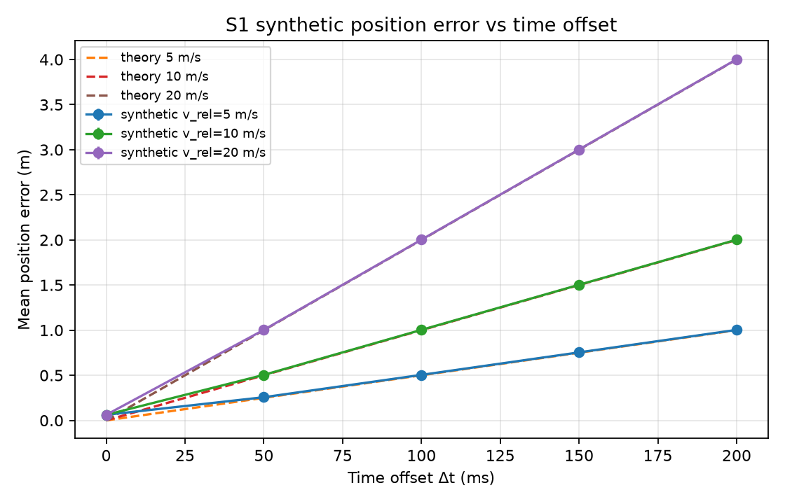

# T4 — Tác động lệch thời gian camera–LiDAR trong mô phỏng ADAS

**NGUYỄN HỒNG CƯỜNG — MSSV 2A202602415**  
Ngày hoàn thiện: 06/10/2026. Bài thực hiện cá nhân; đề gốc yêu cầu 5 thành viên, hiện chưa có xác nhận ngoại lệ.

Repository: https://github.com/hongcuong26-debug/K4-Track4-Day04-2A202602415-Sensor-Reality-Sprint

## 1. Problem

Nền tảng: xe ADAS; tính năng: theo dõi và liên kết mục tiêu phía trước; sensor: camera–LiDAR. Failure case là LiDAR thực đo ở `t−Δt` nhưng được ghép với camera tại `t`. Mục tiêu chuyển động khiến hai tọa độ không còn tương ứng cùng thời điểm.

**Claim:** tăng offset 0 → 50–200 ms làm sai số vị trí trung bình (m) tăng; ở tốc độ tương đối gần hằng, sai số lý tưởng xấp xỉ `v_rel × Δt`. Association ID có thể sai khi lệch vị trí lớn so với khoảng cách giữa mục tiêu. Bù chuyển động có thể giảm sai số, nhưng nhạy với noise và sai offset.

## 2. Method

**Nguồn:** [iKalibr paper, arXiv v2](https://arxiv.org/html/2407.11420v2) và [repo/hướng dẫn](../SOURCES.md). Paper dùng khởi tạo động và tối ưu chuyển động liên tục để hiệu chuẩn không gian/thời gian. Theo README, input là dữ liệu đa sensor có IMU; output là extrinsic và offset thời gian. Phiên bản paper cố định là v2; release repo đối chiếu là v1.2.0 (`3b8741e`); đường chạy nguồn ghi riêng trong SOURCES.md. Bài này không chạy iKalibr, không trích số paper làm kết quả tự đo.

**Pipeline thực chạy:** trajectory 2D có ground truth → tọa độ camera có noise ở `t` và LiDAR có noise ở `t−Δt` → sai số vị trí, nearest-neighbor association và bù vận tốc. Camera được đơn giản hóa thành tọa độ trong cùng hệ với LiDAR; không có ảnh, detector hay extrinsic calibration.

S1 dùng `p(t)=(100−v*t, 0)`. Bù dùng hai mẫu LiDAR gần nhất: `v_hat=(p(t)−p(t−0,1))/0,1`, rồi `p_corrected=p_lidar+v_hat*Δt_assumed`. Thử offset bù đúng và sai ±20 ms. S3 ghép mỗi mục tiêu LiDAR với camera gần nhất độc lập; nhiều LiDAR có thể chọn cùng một camera ID.

Chọn mô phỏng vì repo không có dữ liệu thật/IMU/rosbag và đường chạy gốc cần môi trường khác. Phép thử nhỏ kiểm tra trực tiếp claim về thời gian theo lựa chọn T4 của đề.

## 3. Benchmark

| Thành phần | Cấu hình cố định |
|---|---|
| Dữ liệu | Tổng hợp, 10 s; 100 thời điểm tạo dữ liệu ở 10 Hz |
| Noise | Gaussian độc lập, σ = 0,05 m trên mỗi trục mỗi sensor |
| Seed | 0–9, cùng seed cho các điều kiện so sánh |
| Baseline / lỗi | Offset 0 / 50, 100, 150, 200 ms |
| Cửa sổ đo chung | 97 thời điểm 0,3–9,9 s; loại phần khởi động cho mọi điều kiện |
| S1 | v_rel = 5, 10, 20 m/s |
| S2 mở rộng | v0 = 10, 20 m/s; a = −3, −6 m/s² |
| S3 mở rộng | v_rel = 10 m/s; khoảng cách hai mục tiêu 2, 4, 8 m |

`pos_error = mean(||p_lidar(t)−p_true(t)||₂)` (m), càng thấp càng tốt. `residual_error` dùng tọa độ đã bù với cùng công thức. `assoc_swap_rate = 100 × số ghép sai ID / tổng số ghép` (%). S3 có ground truth ID tổng hợp đã biết. Đây là proxy cho rủi ro fusion, không phải mAP, recall detector hoặc mức an toàn ADAS.

Mỗi hàng CSV là một cấu hình và một seed; tổng 500 hàng, không phải 500 mẫu sensor. Bảng dưới là trung bình ± độ lệch chuẩn của 10 giá trị trung bình theo seed.

| S1, v_rel = 10 m/s | Sai số trước bù (m) | Sau bù offset đúng (m) |
|---|---:|---:|
| Baseline 0 ms | 0,0616 ± 0,0033 | 0,0616 |
| 50 ms | 0,5045 ± 0,0056 | 0,0956 |
| 100 ms | 1,0033 ± 0,0056 | 0,1345 |
| 150 ms | 1,5029 ± 0,0055 | 0,1749 |
| 200 ms | 2,0027 ± 0,0055 | 0,2160 |



Kết quả 150 ms gần giá trị lý tưởng `10 × 0,150 = 1,5 m`. Noise làm baseline khác 0. Khi bù sai −20/+20 ms, residual ở cấu hình này là **0,2459/0,2629 m**, lớn hơn bù đúng **0,1749 m**.

S3: khoảng cách 2 m, sai ID tăng **0% ở 0 ms → 25,31% ở 100 ms → 50% ở 150 ms**. Khoảng cách 8 m vẫn cho 0% ở các offset đã thử; không suy ra mọi tình huống 8 m đều an toàn.

**Tái hiện trên PowerShell:**

```powershell
$env:PYTHONPATH = 'src'
$env:MPLBACKEND = 'Agg'
$env:MPLCONFIGDIR = Join-Path $env:TEMP 'sensor-sprint-matplotlib'
.\.venv\Scripts\python.exe -m pytest -q
.\.venv\Scripts\python.exe -m sensor_sprint.run_benchmark --config configs/t4.yaml
```

Setup máy mới ở [README](../README.md). Python 3.11.9; thư viện chính pin ở [requirements.txt](../requirements.txt), toàn bộ môi trường ở [requirements-lock.txt](../requirements-lock.txt). [Log dùng cho báo cáo](../logs/run_20261006T042135Z.log) ghi commit nền, trạng thái dirty, SHA-256 code/config, phiên bản thư viện và lệnh thực chạy; log cũ là lịch sử. Kết quả: [summary](../results/summary.md), [CSV](../results/results.csv), [config](../configs/t4.yaml), [metric](../docs/metrics.md). Có 6 test kiểm tra tính xác định, công thức không noise, baseline và warm-up; [kết quả kiểm tra](../results/verification.md).

## 4. Failure case và limitation

**Quan sát benchmark:** S3, v_rel = 10 m/s, khoảng cách 2 m, offset 150 ms: dữ liệu LiDAR cũ dịch khoảng 1,5 m và 50% association sai ID. Bằng chứng là các hàng `scenario=S3, d_gap_m=2, dt_ms=150` trong CSV và [heatmap](../figs/s3_assoc_heatmap.png). Đây là wrong-ID assignment độc lập, không nhất thiết hai ID đổi chỗ.

**Suy luận kỹ thuật:** lỗi ID có thể làm fusion cập nhật nhầm track, ảnh hưởng ước lượng khoảng cách/vận tốc. Chưa chạy tracker/điều khiển xe nên không kết luận mức giảm recall, khoảng cách phanh hoặc xác suất tai nạn.

**Nguồn cho biết:** phần VIII paper nêu thiếu ground truth spatiotemporal đầy đủ và yêu cầu kích thích 6-DoF khó cho một số xe mặt đất. Tham số hiệu chuẩn và độ lệch chuẩn trong paper khác sai số vị trí của bài này; không ghép thành so sánh hiệu năng. Các mục nguồn và limitation khác ở [SOURCES.md](../SOURCES.md).

**Giới hạn benchmark:** chuyển động dọc tuyến đơn giản, noise Gaussian, offset cố định; chưa đo jitter, drift clock, rolling shutter, occlusion, extrinsic sai, latency end-to-end hay dữ liệu thật. Offset đúng trong bù là giá trị biết trước, chưa được thuật toán ước lượng. S2 có tốc độ tương đối `v0+a*t` đổi dấu, chỉ là stress test gia tốc không giới hạn, không mô hình phanh tới dừng. Comparator `v0*Δt` ở S2 dùng tốc độ ban đầu, không phải tốc độ tức thời.

## 5. Engineering decision và trade-off

Đề xuất log **timestamp thu nhận, timestamp nhận dữ liệu, offset ước lượng, tốc độ tương đối, residual và association sai**. Dùng `v_rel × |offset|` làm tín hiệu cảnh báo sơ bộ khi chuyển động gần đều. Ngưỡng **0,5 m** là giả định bài, không phải chuẩn công nghiệp. Với 10 m/s, offset 50 ms đã vượt nhẹ ngưỡng theo số đo; đây không phải giới hạn an toàn được chứng nhận.

Khi offset biết đủ chính xác và vận tốc ổn định, thử bù trước fusion: tại 150 ms giảm sai số khoảng **88,4%**. Khi offset không chắc chắn hoặc residual cao, đề xuất giảm trọng số dữ liệu cũ, đánh dấu track không tin cậy và dùng quan sát mới hợp lệ theo logic hệ thống. Các fallback này là đề xuất chưa được benchmark triển khai.

Trade-off: bù hai mẫu ít tính toán nhưng khuếch đại noise vận tốc; bù đúng vẫn chưa về baseline. Chờ frame đồng bộ có thể giảm lệch nhưng tăng độ trễ; bỏ frame cũ giảm nguy cơ ghép sai nhưng giảm lượng dữ liệu. Chưa đo chi phí tính toán/latency của các lựa chọn này.

Vòng thử tiếp theo: dùng cùng seed với jitter, offset ước lượng và gia tốc; so residual trước/sau, wrong-ID rate, tỉ lệ bỏ frame và latency p95 trên log thật. Chỉ giữ cải tiến nếu residual/association tốt hơn và đáp ứng budget latency đặt trước. Dùng mô phỏng này để chọn phép thử/log tiếp theo, chưa làm căn cứ triển khai điều khiển xe.
